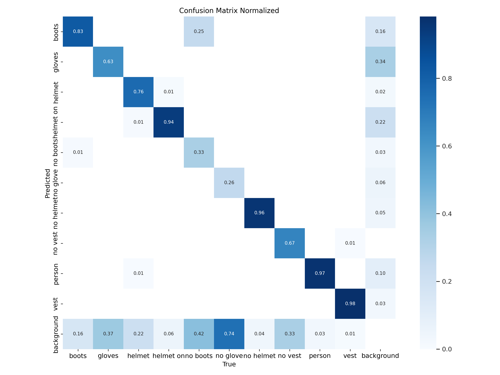
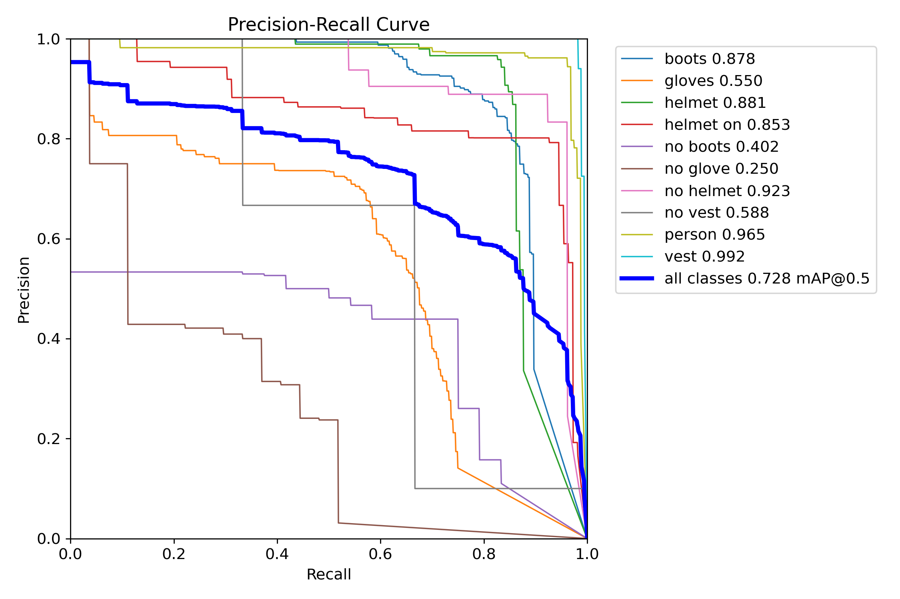

# 🦺 SafeSite AI – Workers Safety System for On-Site Hazard Prevention

An AI-powered construction site safety system that detects missing PPE, monitors for **fire and smoke**, tracks attendance with facial recognition, and presents everything in a Flask web dashboard.

> **Credit:** This project is built on top of the open-source *Autonomous Workers Safety System* by **Ahmed Islam** ([original repository](ORIGINAL-REPO-LINK)). See [What I Added](#-what-i-added) for my contributions.

---

## ✨ Key Features

- 🔍 **PPE Detection (YOLOv8)** – Detects helmets, vests and other PPE in real time.
- 🔥 **Fire & Smoke Detection** – A dedicated model flags fire and smoke in live or recorded video.
- 🧑‍🤝‍🧑 **Facial Recognition Attendance** – Automatically marks employee attendance.
- 📊 **Web Dashboard (Flask)** – Analytics, attendance, violations, employee records and salary reports.
- 🗄️ **SQLite Database** – Stores attendance logs, violations and employee data.
- 📷 **Violation Evidence** – Saves images of each violation for audits.
- 🤖 **Patrol Robot (Arduino)** – Path-memorizing robot code for site patrolling.

---

## 🆕 What I Added

- Integrated **fire and smoke detection** (`static/models/fire_smoke.pt`) alongside the existing PPE detection.
- Restructured the repository, added a `.gitignore`, and removed personal data (face photos, violation images, database) from version control.
- Rewrote the documentation.

---

## 🛠️ Tech Stack

| Area | Tools |
|---|---|
| Computer Vision | YOLOv8, OpenCV, face_recognition |
| Backend | Python, Flask |
| Database | SQLite |
| Frontend | HTML, CSS (Flask templates) |
| Robotics | Arduino (C/C++) |

---

## 📂 Project Structure

```
safesite-ai/
├── Notebook/                  # Training / testing notebook
├── Path memorizer robot/      # Arduino code + circuit diagram
├── Results/                   # Model evaluation curves and samples
├── static/
│   ├── images/                # General images
│   ├── models/                # best.pt (PPE) and fire_smoke.pt (fire & smoke)
│   └── reports/               # Generated charts
├── templates/                 # Flask HTML pages
├── app.py                     # Flask app entry point
├── fire.mp4                   # Sample video for fire/smoke testing
├── requirements.txt
└── LICENSE
```

> `static/employees_faces/`, `static/violation_images/` and `safety_system.db` are **not** included because they hold personal data. Create the folders as shown below.

---

## ⚙️ Installation & Setup

**1. Clone the repository**
```bash
git clone https://github.com/subhalagnanahak/safesite-ai.git
cd safesite-ai
```

**2. Create a virtual environment**
```bash
python -m venv venv
venv\Scripts\activate        # Windows
source venv/bin/activate     # Linux / Mac
```

**3. Install dependencies**
```bash
pip install -r requirements.txt
```

**4. Create the data folders**
```bash
mkdir static/employees_faces static/violation_images
```

**5. Run the app**
```bash
python app.py
```

Open **http://127.0.0.1:5000/** in your browser.

---

## 🖥️ Dashboard Pages

| Page | Purpose |
|---|---|
| Home | System overview |
| Add Employee | Register workers with a face photo |
| Employees | Employee records |
| Attendance | Daily attendance logs |
| Detection | Live PPE and fire/smoke detection |
| Violations | Recorded violations with image evidence |
| Analytics | Compliance charts and reports |
| Salary Details | Attendance-based salary report |

---

## 📈 Results

PPE model evaluation (see the `Results/` folder):

| | |
|---|---|
|  |  |

---

## 🚀 Future Scope

- SMS / email alerts for violations and fire events
- Gas-leak and other IoT sensor integration
- Cloud deployment for multi-site monitoring
- Multi-camera and multi-robot support

---

## 👨‍💻 Author

**Subhalagna Nahak**
B.Tech, Central Tool Room & Training Centre, Bhubaneswar
GitHub: [@subhalagnanahak](https://github.com/subhalagnanahak)

Original project by **Ahmed Islam**.

---

## 📄 License

See the [LICENSE](LICENSE) file. The original copyright notice is preserved as the license requires.